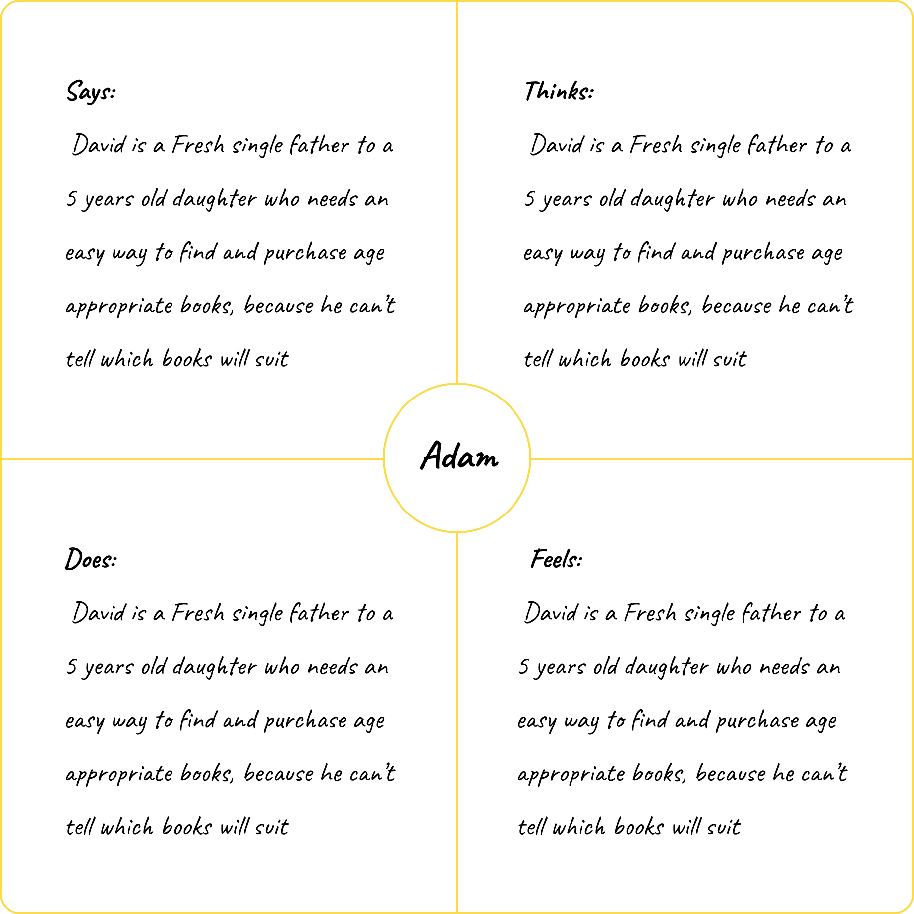

  ### The Product
  UX design for a childrens bookstore mobile app that offers suitable age and content books for children.

  ### Background
  As a fresh mom to a sweet little boy, I wanted to find some nice books for him. Sounds easy, right? well, think again. It appears that most bookstore apps are not very child-oriented, and finding the right books for age and content has become quite a challenge. So I have decided to put on my UX designer hat and go out into the wild to explore new ideas and solutions for such apps. 

  ### The Problem
  Parents are struggling with finding content-appropriate books for their children. This is because bookstore apps often do not offer enough children-oriented information about the books they sell.

## 01  |  Emphasize Phase

  ### Interviews

As a first step, I have performed interviews with potential target audiences. We have discussed the various aspects of finding and buying children’s books, guided by the following questions and assignments:

  1. Describe the way you search and buy a book.
  2. What are the reasons you buy a children's book?
  3. What leads you when choosing a book?
  4. What difficulties did you encounter when searching for a book to buy?
  5. What would you improve in the experience of searching and buying books?

  ### Empathy maps

  Next, I have used empathy maps to further emphasize with users while identifying their specific needs. In this process, the results of the interviews are broken-down and arranged into four quadrants.

  

  

  

