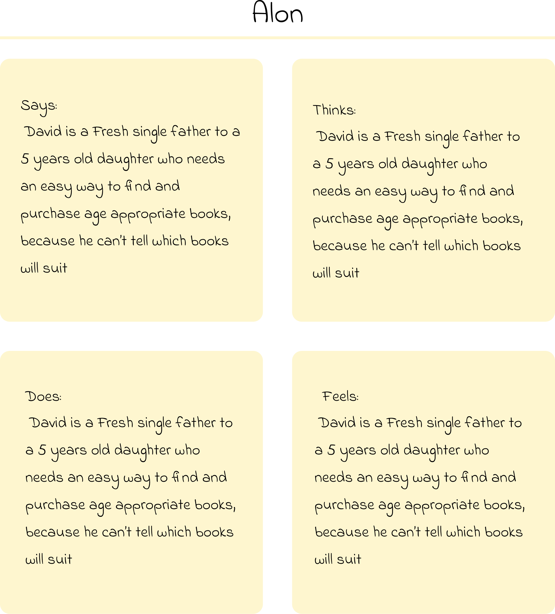
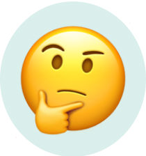

As a fresh mom to a sweet little boy, I wanted to find some nice books for him. Sounds easy, right? well, think again. It appears that most bookstore apps are not very child-oriented, and finding the right books for age and content has become quite a challenge. So I have decided to put on my UX designer hat and go out into the wild to explore new ideas and solutions for such apps. 

> Parents are struggling with finding content-appropriate books for their children. This is because <mark>bookstore apps often do not offer enough children-oriented information about the books they sell.</mark>

## 01  |  Emphasize Phase

### Interviews
I have performed interviews with the potential target audiences. We have discussed the various aspects of finding and buying children's books, guided by the following questions:

- Describe the way you search and buy a book
- What are the reasons you buy a children's book?
- What leads you in choosing a book?
- What difficulties did you encounter while searching for a book to buy?
- What would you improve in the experience of searching and buying books?

### Empathy Maps

Next, I used empathy maps as a tool to emphasize with the users farthermore, and to identify the users needs. I have broken down all the important needs and points that came up from the interviews and that the app can address. 

### Pain Points

Talking to potential users and crafting empathy maps helped me to get into the user's mindset, and allowing me to identify their pain points:

Variety

Users are overwhelmed by the variety of books and have difficulties choosing suitable books.

Lack of  information

bookstore apps often do not offer enough children-oriented information about the books they sell

No spare time 

Users do not have enough spare time to invest in researching for suitable books

### User Persona

In the world of UX design, the user always comes first. But to put users' needs first, we need to know who we are talking about. So based on everything I have learned so far, I started building the user persona. The persona I created represents a group of users with similar characteristics that I learned about during my research.